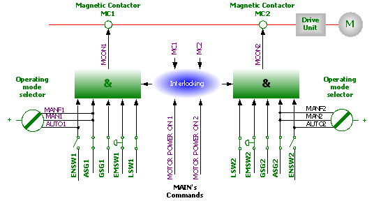

# 1.10.1. 안전 전기회로의 작동

그림 1.5 안전체인 구성도

로봇의 안전 시스템은 그 상태를 계속적으로 감시하는 이중의 안전 전기회로로 되어 있습니다. 만약 에러가 검지되면 모터의 전원을 바로 차단하면서 모터 브레이크를 작동시킵니다. 모터ON 상태로 돌아가기 위해선 이중 전기회로의 스위치가 모두 연결되어야 합니다. 만약 안전회로의 이중 스위치 중 어느 하나라도 단락 되었을 때는 모터의 접촉 자는 끊어지며 브레이크가 작동하여 로봇이 정지합니다. 또한 안전회로가 끊어지면 바로 인터럽트의 원인을 확인하기 위하여 인터럽트 콜이 제어기에 보내집니다. 

조작중의 안전 제어회로는 제어기와 모터 ON 모드가 상호 작용하는 이중의 안전 전기회로를 근거로 합니다. 로봇이 모터ON 모드로 되기 위해선 몇 개의 스위치로 연결되어 구성된 안전 전기회로가 모두 연결되어야 합니다. 모터ON 모드는 모터에 구동전류가 공급됨을 뜻합니다. 만약 안전 전기회로의 어떤 접촉 점이 끊어져 있으면 로봇은 항상 모터OFF 모드로 돌아갑니다. 모터OFF 모드는 로봇의 모터에 구동전류가 공급되지 않고 모터 브레이크가 작동되는 상태를 뜻합니다. 스위치의 상태는 티치펜던트(Teach Pendant)(조작설명서 “I/O 모니터링” 화면 참조)에 표시됩니다. 

<b>안전 전기회로 </b>

제어기 조작반과 티치펜던트(Teach Pendant) 상의 비상정지 버튼과 외부 설비에 설치된 비상정지 버튼은 안전 전기회로에 포함되어 있습니다. 자동 조작모드에서 작동되는 안전장치(안전 플러그, 안전 지역 진입 정지장치 등)는 사용자가 설치할 수 있습니다. 수동조작에서는 안전장치신호가 무시됩니다. 안전장치에 의한 정지는 (전반적인 안전 정지장치) 사용자가 연결하여 모든 작동모드에서 사용할 수 있습니다. 즉 자동 조작모드에서는 모든 안전장치(도어, 안전매트, 안전 플러그 등)가 동작되어 누구도 로봇의 안전지역으로 들어갈 수 없습니다. 이러한 신호는 수동 조작모드에서도 생성되지만, 제어기는 로봇의 티칭(Teaching)을 위하여 무시하고 로봇이 계속 조작되도록 합니다. 이 경우 로봇의 최대 속도는 250 mm/s로 제한됩니다. 즉 이러한 안전 정지장치 기능의 목적은 사람이 로봇을 보전, 티칭(Teaching)하기 위해 로봇에 접근하는 동안 본체 주위에 안전한 영역을 확보할 수 있도록 하는 것입니다. 

리밋 스위치에 의하여 로봇이 정지되면 정수 설정모드에서 티치펜던트(Teach Pendant)의 조작 키(key)로 로봇을 조깅하여 위치를 변화 시킬 수 있습니다. (정수 설정 모드라 함은 “수동모드에서 『[F2]: 시스템』” 메뉴에 진입한 상태를 의미합니다.) 

<blockquote>
<table border="0">
    <thead>
        <tr>
            <td>
            

              
            

            </td> 
            <td colspan="4"> 
                안전 전기회로는 어떠한 방법으로든 결코 무시하거나, 수정, 변경되지 않도록 하십시오.
            </td>
        </tr>
    </thead>
</table>  
</blockquote> 