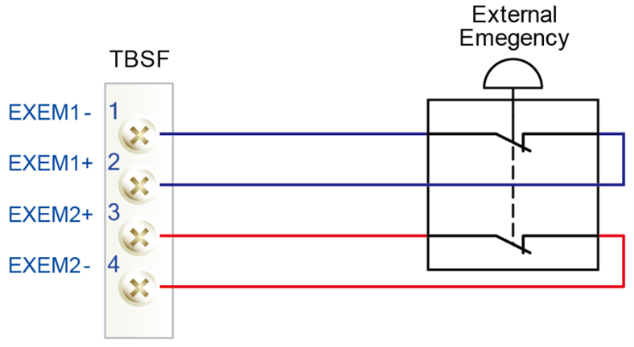

# 1.10.2. 비상정지

비상정지는 사람이나 장비가 위험지역에 있을 때 작동되어야 합니다. 제어기의 조작패널 위의 비상정지 스위치 등 모든 안전제어 장치는 안전영역 밖에서 쉽게 접근되도록 하여야 합니다.

 **비상정지 상태**  

비상정지 버튼이 눌러졌을 때 로봇은 아래와 같이 동작합니다.
어떠한 경우든 로봇은 즉시 정지합니다.

<ol style="list-style-type:square" start="1">
		<li>
            로봇의 서보 시스템 전원을 차단합니다.
        </li>		
		<li>
            로봇의 모터 브레이크가 동작합니다.
        </li>	  
        <li>
        	티치펜던트(Teach Pendant)의 화면에 비상정지 메시지가 표시됩니다.
        </li>
</ol>

비상정지는 아래의 두 가지 방법을 병행할 수 있습니다.

<ol style="list-style-type:decimal" start="1">
		<li>
            조작패널, 티치펜던트의 비상정지 (기본)  
            제어기 조작반과 티치펜던트(Teach Pendant) 위에 있습니다.
        </li> 
		<li>
            외부 시스템 비상정지  
            외부 비상정지장치(스위치 등)는 비상정지 회로의 응용표준에 의하여 안전 전기회로에 연결될 수 있습니다. (“제어기 기본구성”편의 시스템보드를 참조하십시오). 이때 비상정지는 “Normal ON”이 되도록 결선하며 시운전 시 반드시 작동을 확인하여 주십시오.  
        </li> 
</ol>

그림 1.6 시스템보드 터미널블록 TBEM를 통한 외부비상정지스위치의 연결