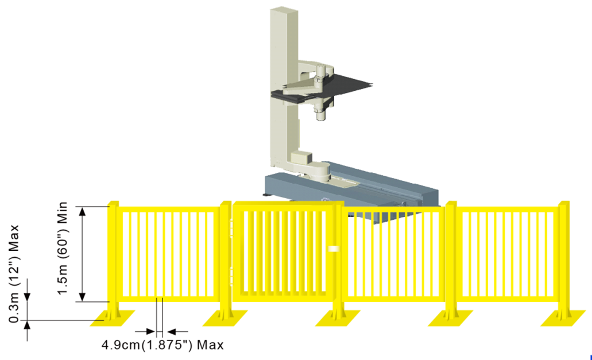
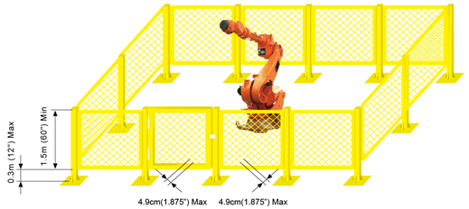

# 1.6.1. 안전 보호망

<blockquote>
<table border="0">
    <thead>
        <tr>
            <td>
            

              
            

            </td>
            <td colspan="4"> 로봇 동작 시 로봇과 작업자가 충돌할 위험이 있기 때문에 작업자가 로봇과 가까이 하지 않도록 안전망을 설치하여 주십시오.</td>
        </tr>
    </thead>
</table>  
</blockquote> 

로봇 동작 시 로봇과 작업자가 충돌할 위험이 있기 때문에 작업자가 로봇과 가까이 하지 않도록 안전망을 설치하여 주십시오. 작업자나 그 밖의 사람이 잘못 진입하여 사고가 발생할 수 있습니다. 로봇이나 용접 치구의점검, 또는 팁 드레싱(tip dressing), 팁교환(tip changing) 을 위해 로봇동작 중에 안전망(fence)의 문을 열고 설비에 접근하면 로봇이 정지하도록 구성하여 주십시오.

그림 1.1 권장 펜스 크기와 출입구 크기(슬롯형 출입구)

그림 1.2 권장 펜스 크기와 출입구 크기(사각형 출입구)

<ol style="list-style-type:decimal" start="1">
		<li>안전망은 로봇 동작영역을 커버하며, 작업자가 티칭(teaching) 작업 및 보수작업 등에 지장이 없도록 충분한 공간을 확보하여야 하며, 쉽게 이동시키지 못하도록 견고하게 하고, 사람들이 쉽게 넘어 들어가지 못하는 구조로 하여 주십시오. </li> 		
		<li>안전망은 원칙적으로 고정식으로 설치해야 하며 요철 또는 예리한 부위 등의 위험부분이 없는 것을 사용하여 주십시오.</li> 	
		<li>안전망 안으로 출입이 가능하도록 출입문을 설치하고, 출입문에는 안전플러그를 반드시 취부하여 플러그를 뽑지 않으면 문이 열리지 않도록 합니다. 또 안전플러그를 뽑거나 안전망이 열린 상태에서는 로봇이 운전준비 OFF, 모터OFF 되도록 배선해 주십시오.</li> 	
		<li>안전플러그를 뽑은 상태에서 로봇을 동작하고자 할 경우에는 저속으로 재생 되도록 배선하여 주십시오.</li> 	
        <li>로봇의 비상정지 버튼은 작업자가 빠르게 누를 수 있는 곳에 설치하여 주십시오. </li> 	
        <li>안전망을 설치하지 않은 경우에는 안전플러그를 대신할 수 있도록, 로봇의 동작범위 내에 들어가는 장소 전체에 광전 스위치, 매트스위치 등을 설치하여, 사람이 진입하였을 때 로봇이 자동으로 정지하도록 해주십시오.</li> 
        <li>로봇의 동작영역(위험영역)은 바닥에 페인트 칠을 하는 것과 같이 식별될 수 있도록 하여 주십시오. </li> 
</ol>