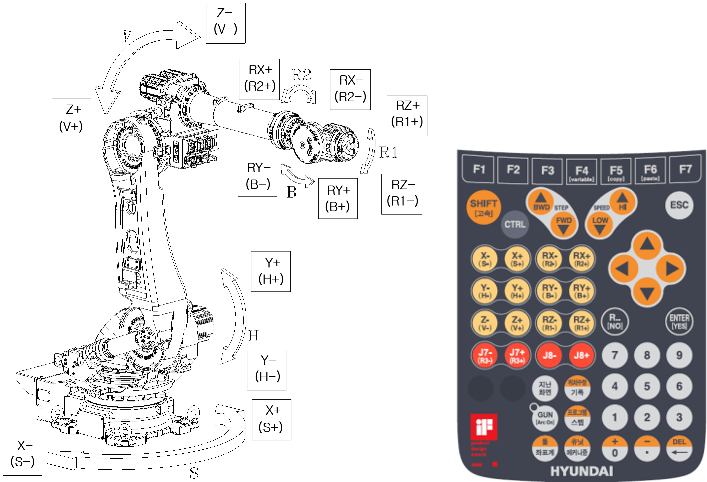

# 2.5. 동작 축 명칭

<table class="tg">
<caption> 표 2-2 각 축의 회전 방향</caption>  
<thead>
  <tr>
    <th class="tg-bgl2">축 명칭</th>
    <th class="tg-bgl2">동작</th>
    <th class="tg-bgl2" colspan="2">티치팬던트 버튼</th>
  </tr>
</thead>
<tbody>
  <tr>
    <td class="tg-jnja">Axis 1 (S)</td>
    <td class="tg-baqh">선회</td>
    <td class="tg-baqh">X+(S+)</td>
    <td class="tg-baqh">X-(S-)</td>
  </tr>
  <tr>
    <td class="tg-jnja">Axis 1 (H)</td>
    <td class="tg-baqh">전후</td>
    <td class="tg-baqh">Y+(H+)</td>
    <td class="tg-baqh">Y-(H-)</td>
  </tr>
  <tr>
    <td class="tg-jnja">Axis 3 (V)</td>
    <td class="tg-baqh">상하</td>
    <td class="tg-baqh">Z+(V+)</td>
    <td class="tg-baqh">Z-(V-)</td>
  </tr>
  <tr>
    <td class="tg-jnja">Axis 4 (R2)</td>
    <td class="tg-baqh">회전 2</td>
    <td class="tg-baqh">RX+(R2+)</td>
    <td class="tg-baqh">RX-(R2-)</td>
  </tr>
  <tr>
    <td class="tg-jnja">Axis 5 (B)</td>
    <td class="tg-baqh">구부림</td>
    <td class="tg-baqh">RY+(B+)</td>
    <td class="tg-baqh">RY-(B-)</td>
  </tr>
  <tr>
    <td class="tg-jnja">Axis 6 (R1)</td>
    <td class="tg-baqh">회전 1</td>
    <td class="tg-baqh">RZ+(R1+)</td>
    <td class="tg-baqh">RZ-(R1-)</td>
  </tr>
</tbody>
</table>
  

그림 2.5 본체 외관 및 동작 축