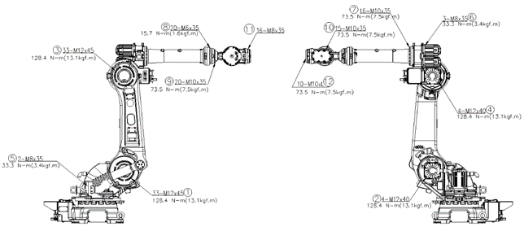

# 4.3. 주요 외부 볼트 점검

<table>
<thead>
  <tr>
    <td> </td>
    <td colspan="4">권장볼트 토크는 아래 그림에 표시되어 있습니다. 반드시 토크 렌치를 사용하여 적정 토크로 체결한 후 페인트 마킹을 하여 주십시오. 볼트는 12.9T (강도 등급)을 사용하여 주십시오.</td>
  </tr>
</thead>
</table>  

표 4-3 주요 볼트 점검 부위 

<table class="tg">
<thead>
  <tr>
    <th class="tg-1e26">No.</th>
    <th class="tg-1e26">점검 부위</th>
    <th class="tg-1e26">No.</th>
    <th class="tg-1e26">점검 부위</th>
  </tr>
</thead>
<tbody>
  <tr>
    <td class="tg-t1e1">1</td>
    <td class="tg-baqh">H축 감속기 취부볼트</td>
    <td class="tg-t1e1">7</td>
    <td class="tg-baqh">ARM PIPE 취부볼트</td>
  </tr>
  <tr>
    <td class="tg-t1e1">2</td>
    <td class="tg-baqh">H축 모터 취부볼트</td>
    <td class="tg-t1e1">8</td>
    <td class="tg-baqh">R2축 감속기 취부볼트</td>
  </tr>
  <tr>
    <td class="tg-t1e1">3</td>
    <td class="tg-baqh">V축 감속기 취부볼트</td>
    <td class="tg-t1e1">9</td>
    <td class="tg-baqh">그립 ASS’Y취부 볼트</td>
  </tr>
  <tr>
    <td class="tg-t1e1">4</td>
    <td class="tg-baqh">V축 모터 취부볼트</td>
    <td class="tg-t1e1">10</td>
    <td class="tg-baqh">B축 감속기 취부볼트</td>
  </tr>
  <tr>
    <td class="tg-t1e1">5</td>
    <td class="tg-baqh">가스 상부 플레이트 취부볼트</td>
    <td class="tg-t1e1">11</td>
    <td class="tg-baqh">R1축 감속기 취부볼트</td>
  </tr>
  <tr>
    <td class="tg-t1e1">6</td>
    <td class="tg-baqh">수축 모터 취부볼트</td>
    <td class="tg-t1e1">12</td>
    <td class="tg-baqh">엔드이펙트 취부볼트</td>
  </tr>
</tbody>
</table>

그림 4.1 주요 볼트 점검 부위
