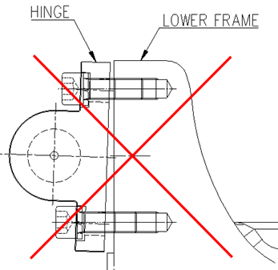

# 8.2.1. 가스 스프링의 분리

가스스프링의 분리는 반드시 H축의 각도를 아래 그림과 같은 자세에서 분리하여 주십시오. 해당 자세는 가스 스프링의 압축력이 최소화되어 로봇에서 분리가 가능한 자세입니다. 따라서 본체에서 가스 스프링을 분리하여도 스프링에 의한 압축력은 평형을 이루게 되므로 분리과정에서 위험요소가 최소화 됩니다. 

단, 가스 스프링 폐기나 내부 수리를 위해서 분리 시에는 가스 스프링의 Gas 배출 절차에 준하여 가스를 완전히 제거 후 분리하여 주시기 바랍니다.

그림 8.1 가스 스프링 분리 자세

<table class="tg">
<thead>
  <tr>
    <th class="tg-baqh">S-Axis</th>
    <th class="tg-baqh">0</th>
  </tr>
</thead>
<tbody>
  <tr>
    <td class="tg-baqh">H- Axis</td>
    <td class="tg-baqh">90</td>
  </tr>
  <tr>
    <td class="tg-baqh">V- Axis</td>
    <td class="tg-baqh">0</td>
  </tr>
  <tr>
    <td class="tg-baqh">R2- Axis</td>
    <td class="tg-baqh">0</td>
  </tr>
  <tr>
    <td class="tg-baqh">B- Axis</td>
    <td class="tg-baqh">0</td>
  </tr>
  <tr>
    <td class="tg-baqh">R1- Axis</td>
    <td class="tg-baqh">0</td>
  </tr>
</tbody>
</table>

<blockquote>
<table border="0">
<thead>
  <tr>
    <td> </td>
    <td colspan="4">

*	가스 스프링의 분리 및 조립 시 아래 그림과 같이HINGE의 볼트는 HINGE가 과다 기울임 발생되지 않도록, 상/하측 볼트를 번갈아 가며 볼트를 45도 이하로 회전 하여 체결 혹은 풀기 하여 주십시오. 
    HINGE의 과다 기울임은 볼트 나사를 손상시키고, 손상된 볼트 나사는 LOWER FRAME의 TAP까지 손상시키게 되어, 분해/조립을 어렵게 합니다.

*	HINGE등 각 부품의 형상은 양산설계에 따라 변경될 수 있습니다.
</td>
  </tr>
</thead>
</table>  
</blockquote>

[볼트 회전량 45도 이하: Approved]

[볼트 회전량 45도 이상: Not Approved]
