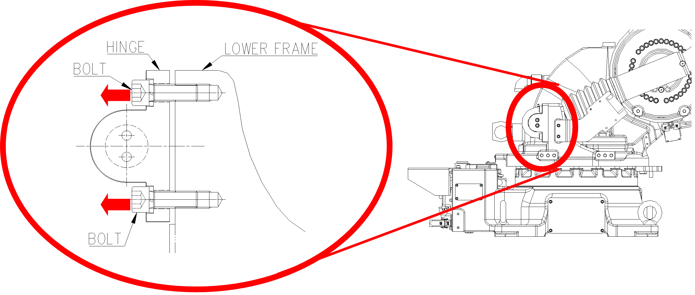

# 9.4.1. 가스 스프링의 분리

가스 스프링의 분리는 반드시 H축의 각도를 [그림9.5]와 같은 자세에서 분리하여 주십시오.
해당 자세는 가스 스프링의 압축력이 최소화되어 로봇에서 분리가 가능한 자세입니다.
따라서 본체에서 가스 스프링을 분리하여도 스프링에 의한 압축력은 평형을 이루게 되므로 분리과정에서 위험요소가 최소화 됩니다.

단, 가스 스프링 폐기나 내부 수리를 위해서 분리 시, H축이 작동하지 않아 H축을 90°로 취할 수 없는 경우에는 ‘9.3. 가스 스프링의 Gas 배출 절차’에 준하여 가스를 완전히 제거하여 주시기 바랍니다.

<table class="tg">
<thead>
  <tr>
    <td class="tg-baqh">H- Axis</td>
    <td class="tg-baqh">90˚</td>
  </tr>
</thead>
</table>

그림 9.5 가스 스프링 분리 자세

<blockquote>
<table border="0">
<thead>
  <tr>
    <td>  </td>
    <td colspan="4">
    - 가스 스프링을 절대 분리하면 안 되는 자세 : H축 90˚ 이외의 각도

(H축90˚ 이외의 자세에서는 가스스프링의 압축력이 과다하여 
HINGE의 볼트를 풀게 되면, 가스스프링의 압력에 의하여 나사산이 망가지며 BOLT가 빠른 속도로 튕겨져 나가게 되고, 인명사고나 장비의 손상을 초래하게 됩니다.)

</td>
  </tr>
</thead>
</table>  
</blockquote>
