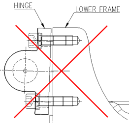

# 9.4.2. 가스 스프링의 조립

가스 스프링의 조립은 반드시 H축의 각도를 [그림9.6]과 같은 자세에서 조립하여 주십시오. 해당 자세는 밸런스 스프링의 압축력이 최소화되어 로봇에 조립이 가능한 자세입니다. 

<table class="tg">
<thead>
  <tr>
    <th class="tg-baqh">S-Axis</th>
    <th class="tg-baqh">0</th>
  </tr>
</thead>
<tbody>
  <tr>
    <td class="tg-baqh">H- Axis</td>
    <td class="tg-baqh">90</td>
  </tr>
  <tr>
    <td class="tg-baqh">V- Axis</td>
    <td class="tg-baqh">0</td>
  </tr>
  <tr>
    <td class="tg-baqh">R2- Axis</td>
    <td class="tg-baqh">0</td>
  </tr>
  <tr>
    <td class="tg-baqh">B- Axis</td>
    <td class="tg-baqh">0</td>
  </tr>
  <tr>
    <td class="tg-baqh">R1- Axis</td>
    <td class="tg-baqh">0</td>
  </tr>
</tbody>
</table>

그림 9.6 가스 스프링 조립 자세

 

<blockquote>
<table border="0">
<thead>
  <tr>
    <td>  </td>
    <td colspan="4">
    
-	가스 스프링의 분리 및 조립 시 그림 9.7 HINGE의 볼트는 HINGE가 과다 기울임 발생되지 않도록, 상/하측 볼트를 번갈아 가며 볼트를 45도 이하로 회전 하여 체결 혹은 풀기 하여 주십시오.
-	HINGE의 과다 기울임은 볼트 나사를 손상시키고, 손상된 볼트 나사는 LOWER FRAME의 TAP까지 손상시키게 되어, 분해/조립을 어렵게 합니다.
-	HINGE등 각 부품의 형상은 양산설계에 따라 변경될 수 있습니다.

</td>
  </tr>
</thead>
</table>  
</blockquote>

[볼트 체결 회전 45도 이하 시 : 나사손상 없음]             

[볼트 회전량 45도 이상 시 : 나사손상]

그림 9.7 가스 스프링 HINGE 볼트 체결 및 풀기 시 주의사항