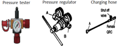

# 9.4.4. 가스 스프링 압력측정 및 가스 충전 부품

표 9-3 가스 스프링 압력측정 및 가스 충전 부품

<table class="tg">
<thead>
  <tr>
    <th class="tg-wa1i">품명규격</th>
    <th class="tg-wa1i">PLATE NO</th>
    <th class="tg-wa1i">대당 수량</th>
    <th class="tg-wa1i">형상</th>
    <th class="tg-wa1i">공급구분</th>
  </tr>
</thead>
<tbody>
  <tr>
    <td class="tg-nrix">GAS SPRING & BS JOINT
& PLASTIC(1) & Nipple</td>
    <td class="tg-nrix">R3200-7230-002(1)</td>
    <td class="tg-nrix">1</td>
    <td class="tg-nrix" rowspan="4"></td>
    <td class="tg-nrix" rowspan="4">Hyundai Robotics(옵션)</td>
  </tr>
  <tr>
    <td class="tg-nrix">Bearing Collar</td>
    <td class="tg-nrix">R3200-7230-218</td>
    <td class="tg-nrix">2</td>
  </tr>
  <tr>
    <td class="tg-nrix">Spherical Bearing 22208</td>
    <td class="tg-nrix">R3200-7230-P02</td>
    <td class="tg-nrix">2</td>
  </tr>
  <tr>
    <td class="tg-nrix">Nilos Ring 22208JV</td>
    <td class="tg-nrix">R3200-7230-P03</td>
    <td class="tg-nrix">4</td>
  </tr>
  <tr>
    <td class="tg-nrix">PRESSURE TESTER-1
(압력측정용)</td>
    <td class="tg-nrix">R3200-7230-R01</td>
    <td class="tg-nrix">1</td>
    <td class="tg-nrix"></td>
    <td class="tg-nrix">Hyundai Robotics(옵션)</td>
  </tr>
  <tr>
    <td class="tg-nrix">REPLENISHING ARMATURE KIT-1
+ GAS BOOSTER KIT-1

1. 질소봄베압력 150bar 이하시
가스 충전용
2. 고객 주문시 포함 항목
: 질소봄베 연결부 나사 사양</td>
    <td class="tg-nrix">R3200-7230-R05
+ R3200-7230-R03</td>
    <td class="tg-nrix">1</td>
    <td class="tg-nrix"></td>
    <td class="tg-nrix">Hyundai Robotics(옵션)</td>
  </tr>
  <tr>
    <td class="tg-nrix">REPLENISHING ARMATURE KIT-1

1. 질소봄베압력 150bar 초과시

   가스 충전용

2. 고객 주문시 포함 항목

   : 질소봄베 연결부 나사 사양
</td>
    <td class="tg-nrix">R3200-7230-R05</td>
    <td class="tg-nrix">1</td>
    <td class="tg-nrix"></td>
    <td class="tg-nrix">Hyundai Robotics(옵션)</td>
  </tr>
  <tr>
    <td class="tg-nrix">GAS BOOSTER KIT-1

1. 질소봄베압력 150bar 이하시 승압용

2. AIR INLET PLUG MALE : R1/4

3. 고객 주문시 포함 항목

: 질소봄베 연결부 나사 사양
</td>
    <td class="tg-nrix">R3200-7230-R03</td>
    <td class="tg-nrix">1</td>
    <td class="tg-nrix"></td>
    <td class="tg-nrix">Hyundai Robotics(옵션)</td>
  </tr>
  <tr>
    <td class="tg-nrix">Air Hose 및 퀵커플링
(Air 공급용)</td>
    <td class="tg-nrix">-</td>
    <td class="tg-nrix">1</td>
    <td class="tg-nrix"></td>
    <td class="tg-nrix">고객</td>
  </tr>
</tbody>
</table>