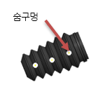
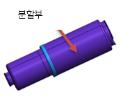
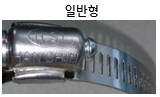

# 9.4.5. 가스스프링 보호커버

<table class="tg">
<thead>
  <tr>
    <th class="tg-amwm">구분</th>
    <th class="tg-amwm">BELLOWS</th>
    <th class="tg-amwm">플라스틱 커버</th>
    <th class="tg-amwm">비고</th>
  </tr>
</thead>
<tbody>
  <tr>
    <td class="tg-amwm">외관</td>
    <td class="tg-baqh"></td>
    <td class="tg-baqh"></td>
    <td class="tg-baqh"></td>
  </tr>
  <tr>
    <td class="tg-amwm">재질</td>
    <td class="tg-baqh">RUBBER(일체형)</td>
    <td class="tg-baqh">PLASTIC(분할형)</td>
    <td class="tg-baqh"></td>
  </tr>
  <tr>
    <td class="tg-amwm">보호 커버 교체 시 가스스프링 분해</td>
    <td class="tg-baqh">O</td>
    <td class="tg-baqh">X</td>
    <td class="tg-baqh"></td>
  </tr>
  <tr>
    <td class="tg-amwm">CLAMP 사양</td>
    <td class="tg-baqh">○ 소 : Cable tie ○ 대 : 12W x Φ103 ○ 렌치크기 :  - ○ 체결토크 :  - </td>
    <td class="tg-baqh">○ 소 : 12W x Φ54 ○ 대 : 12W x Φ103 ○ 렌치크기 : 8mm ○ 체결토크 : 60kg/㎠</td>
    <td class="tg-baqh"></td>
  </tr>
  <tr>
    <td class="tg-amwm">CLAMP 이미지</td>
    <td class="tg-baqh"></td>
    <td class="tg-baqh"></td>
    <td class="tg-baqh"></td>
  </tr>
  <tr>
    <td class="tg-amwm">교체시점</td>
    <td class="tg-baqh">찢어짐 발생시</td>
    <td class="tg-baqh">외부 충격에 의한 파손시</td>
    <td class="tg-baqh"></td>
  </tr>
  <tr>
    <td class="tg-amwm">조립시 주의사항</td>
    <td class="tg-baqh">숨구멍 위치 내측(로봇측)으로 조립</td>
    <td class="tg-baqh">분할부 틈새 없도록 조립</td>
    <td class="tg-baqh"></td>
  </tr>
</tbody>
</table>